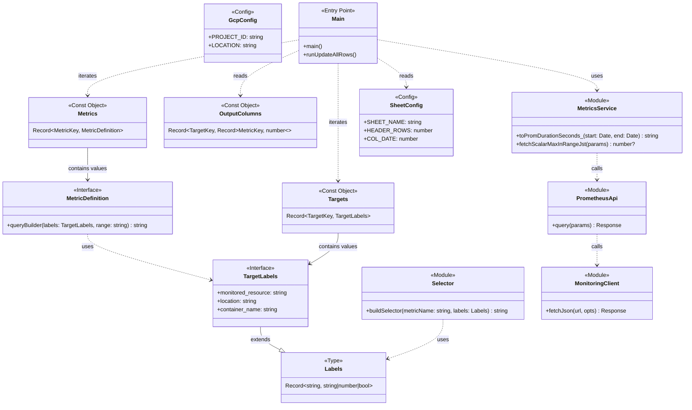

# Architecture

This document describes the system architecture, module dependencies, and data structures of the `loadtest-gas` project.

## Class Diagram

The following diagram illustrates the relationships between type definitions, configuration objects, and core logic modules.

## Module Responsibilities

### Configuration & Definitions
- **config.ts**: Environment-specific settings (GCP Project ID, Sheet names).
- **definitions.ts**: Domain-specific definitions. Mapping of targets to metrics and their corresponding spreadsheet columns.

### Core Logic
- **main.ts**: Orchestrates the spreadsheet update process.
- **metricsService.ts**: High-level service for fetching and processing metrics.
- **prometheusApi.ts**: Low-level client for the Google Cloud Monitoring Prometheus API.
- **monitoringClient.ts**: Handles HTTP requests and OAuth authentication.
- **selector.ts**: Utility to build PromQL selectors from label maps.
- **logger.ts**: Structured logging utility.
